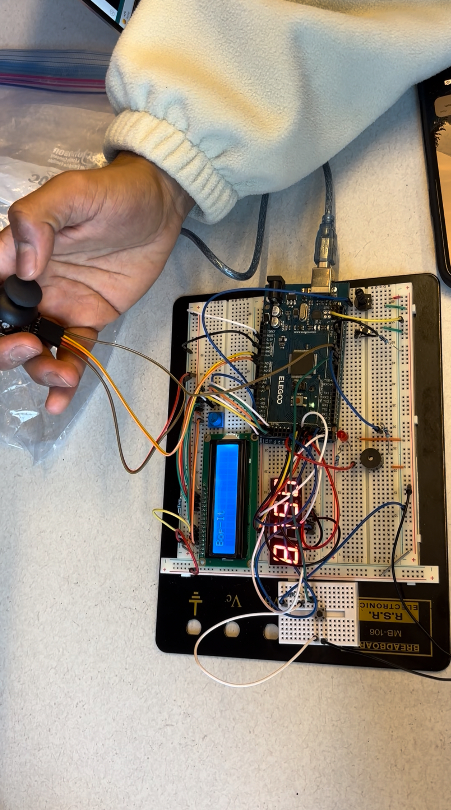

# Arduino Bop-It! Game (FreeRTOS)

This project is an Arduino-based version of the classic "Bop-It!" game, built using FreeRTOS for multitasking. It features multiple physical inputs (joystick, button, potentiometer), an LCD for task display, and a 7-segment display for countdown timing. The game randomly selects actions for the player to perform-such as flicking the joystick in a direction, pressing a button, or twisting a potentiometer-within a time limit.

---

## Features

- **Multiple Game Actions:**  
  - Joystick flick (up, down, left, right)
  - Joystick button press
  - Potentiometer twist
  - External button press (Bop-It)
- **Randomized Gameplay:** Each round selects a random action.
- **FreeRTOS Multitasking:** Each action and display runs as a separate task.
- **Visual Feedback:**  
  - 16x2 LCD displays the current action.
  - 4-digit 7-segment display shows the countdown timer.
  - External LED and serial output for debugging.
- **Game Over Handling:** LCD displays end screen and waits for reset.
- **Media:** Includes two photos and one video demonstration.

---

## Hardware Requirements

- Arduino Mega (or compatible)
- 16x2 LCD display
- 4-digit 7-segment display (with SevSeg library)
- Joystick module (with button)
- Potentiometer
- Pushbutton (for "Bop-It" action)
- External LED (optional)
- Jumper wires

---

## Pin Connections

| Arduino Pin | Function                  | Module Connection        |
|-------------|---------------------------|-------------------------|
| 4           | Bop-It Button             | Pushbutton              |
| 7           | Joystick Button           | Joystick SW             |
| A0          | Joystick X-axis           | Joystick VRX            |
| A1          | Joystick Y-axis           | Joystick VRY            |
| A7          | Potentiometer             | Potentiometer           |
| 35          | External LED (optional)   | LED                     |
| 53,52,51,50,49,48 | LCD (rs,en,d4-d7)   | LCD pins                |
| 34,31,30,28 | 7-seg Digit Pins          | 7-segment display       |
| 33,29,26,24,23,32,27,25 | 7-seg Segments | 7-segment display       |

---

## How It Works

- On startup, the LCD prompts the user to press the button to start.
- Each round, a random action is selected and displayed on the LCD.
- The player must perform the correct action (e.g., flick the joystick up, press the button, twist the potentiometer) before the timer runs out.
- The 7-segment display shows the countdown timer.
- If the action is performed in time, a new round starts with a different action.
- If the timer expires, the game ends and the LCD displays a "Game Over" message.
- Pressing the button resets the game.

---

## Usage

1. Connect all hardware as described above.
2. Upload the code to your Arduino Mega.
3. Power on the system. The LCD will prompt you to start.
4. Press the button to begin. Follow the instructions shown on the LCD and perform the indicated action before time runs out.
5. The game continues with new random actions until a mistake is made or time expires.
6. To play again, press the button when the "Game Over" screen is displayed.

---

## Media

---

## Example: Task Creation and Game Logic

// Example: Creating a FreeRTOS task for joystick flick up
xTaskCreate(TaskJoyStickFlickUp, "FlickUp", 256, NULL, 2, &xTaskJoyStickFlickUp);

// Example: LCD displays current action
lcd.clear();
lcd.print(TASKDISPLAYS[currTask]); // e.g., "Flick-It Up"

---

## License

MIT License

---

## Credits

Project by Nathan Cannell and Tegbir Lalli.  
Photos and video included for demonstration purposes.

---

## Contact

For questions or suggestions, open an issue or contact me via GitHub.
